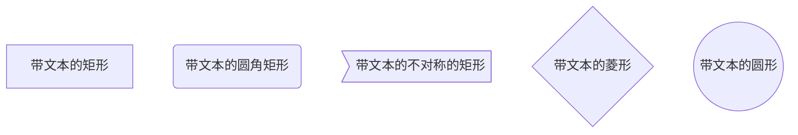

决策树（decision tree）是一种常见的机器学习方法，是一种基本的分类和回归方法。本文主要讨论用于分类的决策树。  

决策树是树形的，在分类问题中，表示的是基于特征对实例进行分类的过程，可以认为是`if-then`规则的集合，
也可以认为是定义在特征空间与类空间上的条件概率分布。主要优点是可读性高、分类速度快。在学习阶段，利用训练数据，
根据损失函数最小化原则建立决策树模型。预测时，对新的数据，利用决策树模型进行分类。

决策树学习通常包含3个步骤：
- 特征选择
- 决策树的生成
- 决策树的修剪

决策树的思想主要来源于Quinlan在1986年提出的ID3算法和1993年提出的C4.5算法，以及由Breiman等人在1984年提出的CART算法。

本文会首先介绍决策树的基本概念，然后通过ID3和C4.5介绍特征选择、决策树的生成以及决策树的修剪，最后介绍CART算法。  

## 决策树模型与学习
### 决策树模型

**定义**  分类决策树模型是一种描述对实例进行分类的树形结构。决策树由节点（node）和有向边（directed edge）组成。节点有两种类型：
内部节点（internal node）和叶节点（leaf node）。内部节点表示一个特征或属性，叶节点表示一个类。

用决策树分类，从根节点开始，对实例的某一特征进行测试，根据测试结果，将实例分配到子节点；这时，每一个子节点对应着该特征的一个取值。
如此递归地对实例进行测试与分类，直至达到叶节点，最后将实例分到叶节点的类中。

```flow
st=>start: 开始框
op=>operation: 处理框
cond=>condition: 判断框(是或否?)
sub1=>subroutine: 子流程
io=>inputoutput: 输入输出框
e=>end: 结束框
st->op->cond
cond(yes)->io->e
cond(no)->sub1(right)->op
```


### 决策树与`if-then`规则
### 决策树与条件概率分布

## 特征选择
### 特征选择问题
### 信息增益
### 信息增益比
### ID3算法
### C4.5的生成算法

## 决策树的剪枝

## CART算法
### CART生成
### CART剪枝

## 本文概要

参考李航的《统计学习方法》
